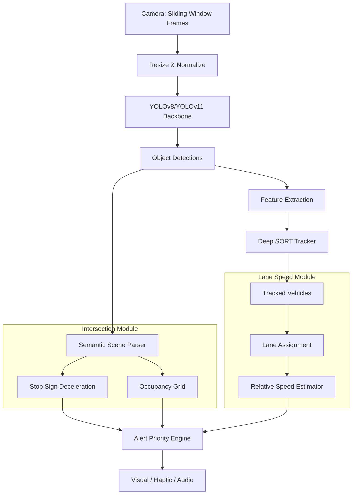

<div align="center">

# 🚗 Driving-CivicSense-Vision-Model

> *Turning windshield cameras into proactive traffic rule advisors.*

**AI-driven auxiliary perception for intersection discipline and lane-awareness.**

[](LICENSE)
[](https://www.python.org)
[](https://github.com/ultralytics/ultralytics)
[](CONTRIBUTING.md)

</div>

---

## 🧠 What Is This?

**Driving-CivicSense-Vision-Model** is an aftermarket Computer Vision system designed for AR glasses or dashcam accessories. It processes real-time forward-facing video to solve **two critical, under-addressed driving failures**:

| # | Problem | Solution |
|---|---------|----------|
| 🛑 | **Stop & Intersection Violations** (T-bone collisions) | Real‑time stop sign compliance + intersection occupancy detection |
| 🚗 | **Left‑Lane Camping** (traffic compression) | Relative lane speed estimation + "Merge Right" reminders |

The system runs **entirely on-device** (Edge AI) — privacy, < 50ms latency, no cloud dependency.

---

## 🚨 The Problems We Solve

### 1. The Intersection "Blocking" Crisis
- **~40%** of all crashes occur at intersections (NHTSA).
- "Blocking the box" — entering a congested intersection on green and failing to clear — causes T‑bone impacts.
- Current ADAS detects vehicles but **fails** to semantically interpret intersection occupancy.

### 2. The "Left-Lane Camping" Epidemic
- Many drivers don't realize the **speed differential** between their lane and the lane to their right.
- Camping in the left lane causes traffic compression, road rage, and reduces highway throughput.
- GPS doesn't provide dynamic, real-time lane-level speed awareness.

---

## 🏗️ System Architecture



---

## 🚧 Project Status

**⚠️ Pre‑alpha / Skeleton.** All modules are stubbed with `NotImplementedError`.

- [x] Project structure & module layout
- [x] Object detection skeleton (`YOLODetector`)
- [x] Multi-object tracking skeleton (`MultiObjectTracker`)
- [x] Intersection module skeleton
- [x] Lane speed module skeleton
- [x] Utility functions skeleton
- [ ] **YOLOv8 ONNX inference** 
- [ ] **Deep SORT integration** 
- [ ] **Real intersection occupancy grid** 
- [ ] **Relative speed estimation** 
- [ ] **100-mile real-world validation** 

See the full roadmap in [CONTRIBUTING.md](CONTRIBUTING.md).

---

## 🛠️ Tech Stack

| Layer | Technology |
|-------|-----------|
| 👁️ Detection | YOLOv8n / YOLOv11n (INT8 quantized) |
| 🔗 Tracking | Deep SORT (BoT-SORT) via boxmot |
| 📐 Geometry | Pinhole camera model + IPM |
| ⚡ Edge AI | Qualcomm AR1, Coral, Raspberry Pi 5 + Hailo-8L |
| 🚀 Framework | ONNX Runtime / TensorRT |

### Performance Targets

| Device | Inference Time | Power | Use Case |
|--------|---------------|-------|----------|
| Qualcomm Snapdragon AR1 | ~22 ms | < 500 mW | AR Glasses |
| Google Coral Dev Board | ~15 ms | 2 W | Dashcam |
| Raspberry Pi 5 + Hailo-8L | ~18 ms | 8 W | DIY Kit |

---

## 🚀 Quick Start (Development)

```bash
# Prerequisites: Python 3.9+, Git
git clone https://github.com/arpanpathak/driving-civicsense-vision-model.git
cd driving-civicsense-vision-model

# Create virtual environment
python3 -m venv .venv
source .venv/bin/activate

# Install dependencies
pip install -r requirements.txt
```

```bash
# Run on a video file (will error on NotImplemented stubs — expected!)
python src/pipeline.py --source path/to/dashcam_video.mp4 --visualize
```

> **Note:** `NotImplementedError` is intentional — pick a module and start building!

---

## 📊 Alert Types

| Alert | Trigger | Latency |
|-------|---------|---------|
| 🛑 **Stop Sign Warning** | Stop sign detected, ego > 10 mph, distance < 50 ft, no braking | 40 ms |
| ⛔ **Blocked Intersection** | Occupancy > 70%, ego > 15 mph, distance < 30 ft | 50 ms |
| ➡️ **Lane Courtesy Reminder** | Right lane +5 mph faster for > 3 seconds | 60 ms |

---

## 🔒 Privacy

- **100% on-device** — no video leaves the device.
- **No cloud dependency** — inference, tracking, and alerts are all local.
- **No recording** — real-time analysis only, no persistent video storage.

---

## 📜 License

**GNU AGPL v3** — protecting against proprietary appropriation.

- ✅ **You can** use, fork, modify, and distribute — even commercially.
- ✅ **You can** deploy it as a service.
- ❌ **You cannot** incorporate it into a closed‑source proprietary product without releasing your source code.
- ❌ **Big tech cannot** swallow this into their proprietary ADAS without giving back.

See the [full license](LICENSE) for details.

---

## 🤝 Contributing

We need:
- 📸 **Data labelers** — annotate "blocked intersection" scenarios
- 🔧 **Edge engineers** — optimize TensorRT pipeline
- 🚗 **Testers** — run on your dashcam and report performance

See [CONTRIBUTING.md](CONTRIBUTING.md) for how to get started.

---

<div align="center">

*Built with ❤️ to make every mile a socially aware mile.*

⭐ **Star this repo if you believe traffic should be cooperative, not competitive.**

</div>
