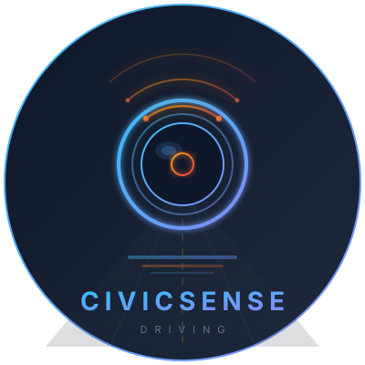
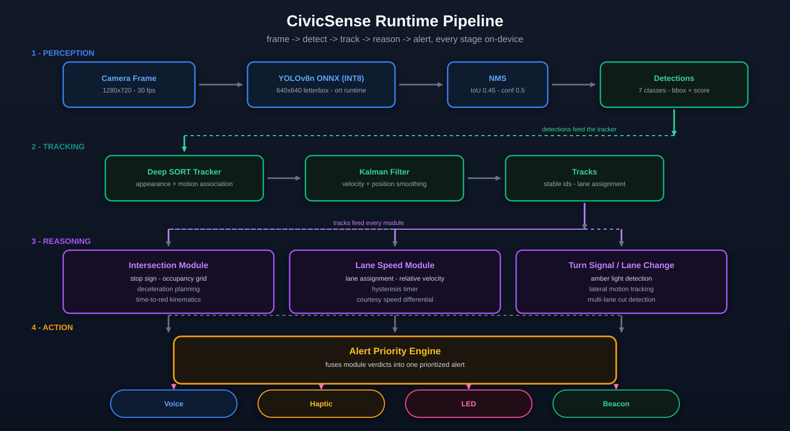
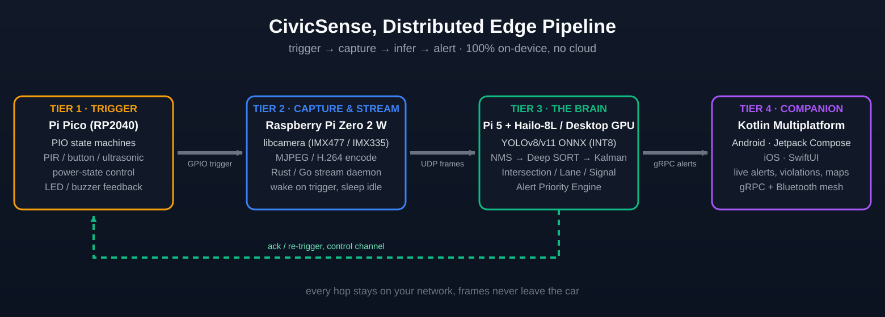
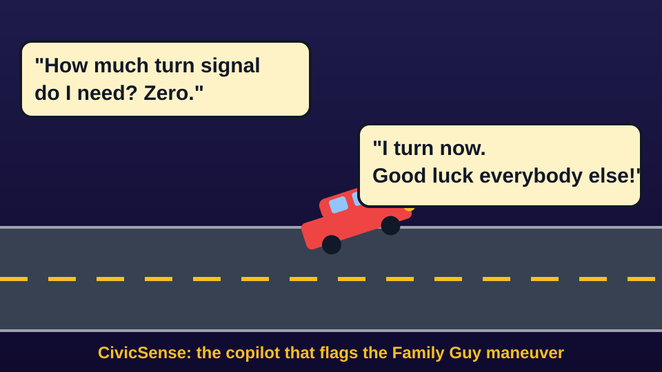
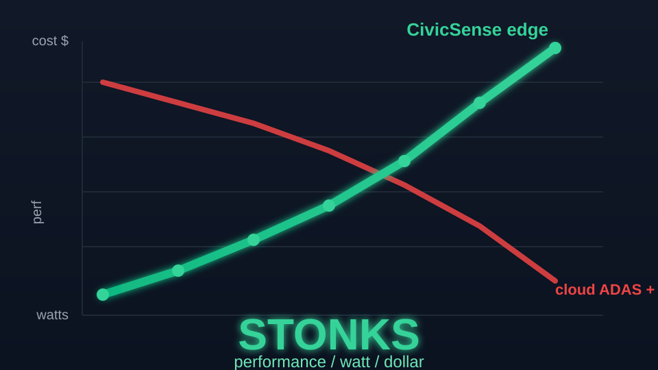

<div align="center">



# CivicSense

> *Aftermarket AI vision for your windshield. Voice-guided, edge-native, socially aware.*
>
> *don't trust your vision if it's blurry,*
> *don't rush the yellow in a hurry,*
> *the math is proven, the call is true,*
> *better safe than sorry, let it clear, then pass through.*

**Edge AI perception for intersection discipline, lane courtesy, road hazard alerts, and cooperative safety, running on NVIDIA Jetson Orin Nano Super, 3D-printed smart glasses, or dashcam hardware.**

[](LICENSE) [](CONTRIBUTING.md) [](https://github.com/arpanpathak/driving-civicsense-vision-model/actions) [](https://www.rust-lang.org) [](https://github.com/ultralytics/ultralytics) [](https://onnxruntime.ai/) [](https://github.com/huggingface/candle) [](https://en.wikipedia.org/wiki/Kalman_filter) [](https://www.nvidia.com/en-us/autonomous-machines/embedded-systems/jetson-orin/) [](https://arxiv.org/abs/1703.07402) [](https://carla.org/) [](https://eclipse.dev/sumo/) [](https://arxiv.org/abs/1708.06374) [](https://www.iso.org/standard/68383.html) [](https://doi.org/10.1287/opre.8.1.112) [](https://arpanpathak.github.io/driving-civicsense-vision-model/) [](https://arpanpathak.github.io/seeing-machines-book/foreword.html) [](https://github.com/arpanpathak/civicsense-companion) [](https://github.com/arpanpathak/civicsense-pi-stream) [](https://github.com/arpanpathak/civicsense-stream-client) [](CLOUD_TRAINING.md) [](https://github.com/arpanpathak/driving-civic-sense-data-crowd)

</div>

---

## The Vision

CivicSense is an aftermarket edge-AI accessory that clips onto glasses or mounts on a dashcam. It watches the road, understands traffic behavior, detects hazards, and talks to you, politely but firmly.

It's not a self-driving system. It's a **co-pilot that cares about traffic civility**, a civic sense teacher on your dashboard.

### The engineering vision

- **Privacy-first**, 100% on-device inference. No video ever leaves the device.
- **Ultra-fast & low latency**, a perception pipeline that must react in real time, from frame to voice in a blink.
- **Low power-hungry**, squeezing serious computer vision onto watts, not kilowatts.
- **Distributed edge pipeline**, don't cram YOLO into 512 MB; a Pico triggers, a Pi Zero streams, and a Pi 5 / desktop GPU runs the heavy inference.
- **3D-printed hardware accessories**, open, printable frames and dashcam pucks, not black-box gadgets.
- **Copilot as civic sense teacher**, alerts that correct, teach, and nudge good road citizenship.

### What it says to you

| Situation | Voice Alert |
|-----------|-------------|
| Someone merging slowly ahead | *"Move to the middle lane, someone slow is merging."* |
| You're crawling in the left lane | *"Speed up, too slow! You're holding up traffic."* |
| Someone passing on the right | *"You're getting passed from the right. Maybe choose the correct lane."* |
| Stop sign ahead, you're not slowing | *"Stop sign in 200 feet. You need to brake."* |
| Green light, but the box is still full | *"Green light, but the intersection's still blocked. Hold back, don't block the box."* |
| Bear or deer on the road | *"Large animal ahead. Slow down."* |
| Fallen tree or debris | *"Obstruction in the road ahead. Stop or take evasive action."* |
| Emergency vehicle approaching | *"Emergency vehicle behind you. Pull right."* |
| Lane change with no signal | *"Turn signal? Or do you expect everyone to read your mind?"* |
| Cutting across multiple lanes | *"That's three lanes without a signal. Pick a lane and commit."* |
| Late signal during merge | *"Signal first, then merge. That's the deal."* |

### What it does for everyone else

Beyond just alerting you, CivicSense broadcasts to the mesh:

- **Hazard beacons**, Detects fallen trees, animals, debris, crashes and broadcasts their GPS coordinates to nearby vehicles via short-range radio (or cellular fallback).  
  *"Fallen tree reported 500m ahead on Highway 1. Approach with caution."*

- **Officer notification**, When a serious road hazard, blocked intersection, or erratic driving is detected, CivicSense can relay an anonymous report to the nearest patrol unit. Not a dashcam upload, just a data beacon: *"Intersection blocked at Main & 5th. High likelihood of gridlock."*

- **Cooperative awareness**, If three CivicSense units detect the same hazard independently, the system auto-escalates to a verified road condition alert.

This turns every unit from a personal assistant into a **distributed sensor node**, making roads safer for everyone, not just the person wearing them.

---

## Research Paper: Deterministic Intersection Blockage Prediction

> **[\"Deterministic Intersection Blockage Prediction: A Kinematic Framework with Mathematical Proofs and a Modular Rust Implementation\"](https://arpanpathak.github.io/driving-civicsense-vision-model/)** is a peer-review-ready paper on the deterministic decision engine behind CivicSense's blocked-box alerts.

The paper formalises the intersection "dilemma zone" with five theorems (each proved in the [complete proofs appendix](https://arpanpathak.github.io/driving-civicsense-vision-model/appendix.html)), derives the stopping and clearance conditions from first principles, and presents the severity-ordered Rust rule pipeline (`rule_light -> rule_dilemma -> rule_lead -> rule_cutin -> rule_stale`). Zero training data. Zero external dependencies. Fully interpretable and ISO 26262-friendly.

- **Read the paper** -> [arpanpathak.github.io/driving-civicsense-vision-model/](https://arpanpathak.github.io/driving-civicsense-vision-model/)
- **Proofs appendix** -> [arpanpathak.github.io/driving-civicsense-vision-model/appendix.html](https://arpanpathak.github.io/driving-civicsense-vision-model/appendix.html)
- **PDF** -> [research_paper/paper.pdf](research_paper/paper.pdf)
- **LaTeX source** -> [research_paper/paper.tex](research_paper/paper.tex)

---

## The Book: *Seeing Machines*

> **["Seeing Machines: Deep Learning & Computer Vision from Python to Bare Metal"](https://arpanpathak.github.io/seeing-machines-book/foreword.html)**, the companion book to this project, written by the same author.

This repo is the capstone project behind the book, and the book is the engineer's diary behind the repo: every line of code written after a mistake, every equation derived after a model failed to converge, a tracker lost its target, or a pipeline got squeezed onto a tiny edge device.

Together they tell one story, **how to take computer vision from cloud to bare metal**: from Python prototypes to an ultra-fast, privacy-first, low-power Rust pipeline, plus a [Kotlin Multiplatform companion app](https://github.com/arpanpathak/civicsense-companion) on Android and iOS.

**Read the foreword -> [arpanpathak.github.io/seeing-machines-book/foreword.html](https://arpanpathak.github.io/seeing-machines-book/foreword.html)**

---

## Product Form Factors

| Form | Hardware | Target Price |
|------|----------|-------------|
| **Smart glasses clip** | 3D-printed frame + camera module + Qualcomm AR1 | < $50 BOM |
| **Dashcam puck** | Raspberry Pi Zero + camera + Hailo-8L NPU | < $80 BOM |
| **Jetson brain** | NVIDIA Jetson Orin Nano Super (67 INT8 TOPS, 8 GB) | ~$249 |
| **Phone companion** | Uses existing phone camera (GPS + alerts via Bluetooth) | Free app |

All variants process **100% on-device**. No cloud upload. No subscription.

> The **primary deployment target** for the inference pipeline is the **NVIDIA Jetson Orin Nano Super** - 67 INT8 TOPS of AI compute, 8 GB of unified memory, and 7 - 15 W of power envelope. It runs the full YOLO + Deep SORT + kinematic decision engine pipeline at real-time speeds entirely on-device. Huge respect to NVIDIA for democratizing edge AI at this price point.


---

## Architecture

The runtime flow - frame, detect, track, reason, alert - runs entirely
on-device:

<p align="center">
   YOLOv8n ONNX -> NMS -> detections -> Deep SORT + Kalman -> tracks -> intersection/lane/turn-signal modules -> alert priority engine -> voice/haptic/LED/beacon" width="1000"/>
</p>

### Model architecture (YOLOv8n)

The perception model is a **YOLOv8n** detector (`yolov8n.pt`, `imgsz=640`, see
[Cloud Training](CLOUD_TRAINING.md)): a C2f backbone (repeats 3/6/6/3,
channels 16/32/32/64/64/128/128/256/256/256) with SPPF pooling, a PAN
multi-scale neck, and three **anchor-free** detection heads. Each anchor
predicts `4 box coords + 7 class scores` (11 channels, no objectness) at
80x80, 40x40 and 20x20 scales: 8400 predictions in total, decoded by
`AnchorGrid` in `src/detection/yolo.rs`.

The full layer-by-layer diagram (neurons, kernels, tensor shapes) is hosted in
the [data pack repo](https://github.com/arpanpathak/driving-civic-sense-data-crowd)
(`assets/cnn-architecture.svg`):

<p align="center">
  
</p>

---

## The Simple Way: Camera -> Jetson (Recommended)

If you have an **NVIDIA Jetson Orin Nano Super** (or any Jetson with a CSI port), the whole pipeline runs on **one board**. No Pi Zero, no Pico, no network hops. Just plug in a camera and go:

```
[ CSI Camera ] ──-> [ Jetson Orin Nano Super ]
                       │
                       ├── YOLOv8n ONNX (INT8, ~12 ms)
                       ├── Deep SORT + Kalman
                       ├── Kinematic Decision Engine (Rust)
                       └── gRPC -> KMP Companion App
```

The Jetson has:
- **CSI camera connector** - direct, zero-latency capture
- **67 INT8 TOPS** - runs YOLO inference at real-time speeds
- **8 GB unified memory** - enough for the full stack
- **7 - 15 W** - runs off a car USB-C port

This is the configuration you want for a real deployment. The distributed pipeline below exists for one reason: **if you don't have a Jetson**, you can still run CivicSense by splitting the work across cheap commodity boards.

---

## The Distributed Way: Pico -> Pi Zero -> Brain (Budget / DIY)

If you don't have a Jetson and want to build from spare parts, squeeze YOLO out of a Pi Zero is a losing game - you trade accuracy for 2 FPS and watch it thermal-throttle. **Don't embed, distribute.** Each node does the job it's best at:

<p align="center">
  
</p>

| Tier | Node | Job | Stack |
|------|------|-----|-------|
| **1 · Trigger** | Raspberry Pi Pico (optional) | Physical sensing & control: PIR motion, buttons, ultrasonic, power states, LED/buzzer | RP2040 **PIO** state machines |
| **2 · Capture** | CSI camera or Pi Zero | Direct capture (Jetson CSI) or remote stream (Pi Zero MJPEG) | libcamera, Rust stream daemon |
| **3 · Brain** | **NVIDIA Jetson Orin Nano Super** | Heavy inference: YOLO ONNX (INT8), NMS, Deep SORT + Kalman, alert engine | ONNX Runtime, Rust |
| **3-alt · Budget brain** | Pi 5 + Hailo-8L / desktop GPU | Same as Tier 3, for those without a Jetson | ONNX Runtime, Rust |
| **4 · Companion** | Phone (KMP) | Live alerts, violations, map view | Kotlin Multiplatform, gRPC |

> **With a Jetson:** skip Tiers 1 and 2. Plug a CSI camera directly into the Jetson. Everything runs on one board. The Pico and Pi Zero are only needed if you're building from spare parts without a Jetson.

**Streaming stack (included as submodules, MIT licensed):**

- [**civicsense-pi-stream**](https://github.com/arpanpathak/civicsense-pi-stream) (`pi_stream/`): Tier 2. A pure-Rust MJPEG streaming server for the Pi Zero 2 W + Arducam IMX335, ~50 MB RAM, with a full headless setup guide.
- [**civicsense-stream-client**](https://github.com/arpanpathak/civicsense-stream-client) (`pistream_client/`): Tier 3. A Rust client that runs YOLOv8n on every frame with Candle (pure-Rust ML), draws boxes, and saves annotations. No Python, no ONNX Runtime.

Both are dependency-free-of-Python and intentionally kept permissive (MIT), unlike the core repo's AGPL-3.0, so the streaming plumbing can be reused anywhere.

**Dataset & ground-truth pack (included as a submodule, MIT licensed):**

- [**civicsense-data-pack**](https://github.com/arpanpathak/driving-civic-sense-data-crowd) (`datasets/`): the official training + validation data companion. Ships the **7-class YOLO training vocabulary** (`stop_sign, traffic_light, crosswalk, vehicle, truck, bus, intersection_zone`), directory-layout and label validators (`civicsense-data`), a **field-validation ground-truth schema + seed manifest** for the kinematic decision engine, and public-dataset aggregation tooling (COCO / BDD100K). It is intentionally lean in git - no pixels - so it stays MIT-licensed and reusable everywhere. See the [repo README](https://github.com/arpanpathak/driving-civic-sense-data-crowd) for how to fetch and aggregate data into `data/civicsense/` (the input `civicsense train prepare` expects).


**When the distributed approach makes sense (no Jetson available):**

- **The Pico's PIO** handles triggers with zero CPU cost, the camera only wakes when there's something to see.
- **The Pi Zero** stays a dumb, low-power camera node: capture, encode, stream. No model to squeeze, no RAM anxiety, no thermal throttling.
- **The brain** (Pi 5 or desktop GPU) runs the full-fat model, you never trade accuracy to fit in 512 MB.
- **Every hop stays on your network**, frames leave the Pi Zero, but they never leave the car.

**But honestly:** if you have a Jetson Orin Nano Super, skip all of this. Plug a CSI camera into the Jetson. One board. No network hops. Zero added latency. The distributed approach is a **fallback for those without a Jetson**, not the recommended path.

```text
# Jetson (recommended):
[ CSI Camera ] ──-> [ Jetson Orin Nano Super ] ──-> [ KMP Companion App ]

# Or, if you don't have a Jetson:
[ Pi Pico ] --GPIO trigger--> [ Pi Zero ] --UDP frames--> [ Brain: Pi 5 / GPU ]
     ^                                                         |
     +---------------------- ack / re-trigger -----------------+
                                                               v
                                                   [ KMP Companion App ]
```

---

## Data Collection for Evaluation

The decision engine is zero-training, but validating it needs real data: field inputs must satisfy the theorem assumptions (accurate speed, distance, signal timing), and ground truth must say what actually happened. The sensor suite below is what makes the mathematical guarantees transfer to a real vehicle. Dashcam footage alone is a starting point, but speed and signal timing then have to be estimated or annotated by hand, which limits the conclusions.

| Modality | Quantities | Typical accuracy | Role |
|---|---|---|---|
| GNSS (RTK-capable) | position, speed, heading, UTC time | 0.02-2 m | ego ground truth, sync clock |
| OBD-II / CAN bus | ego speed, brake, steering | 0.1 m/s | ego speed, acceleration |
| IMU | acceleration, angular rate | 0.01 g | ego dynamics, pitch/roll |
| Camera (calibrated) | RGB at 30-60 fps | 1 px jitter | perception input |
| Radar | range, range rate, azimuth | 0.1 m, 0.1 m/s | lead-vehicle fusion |
| LiDAR | 3D point cloud | 2-3 cm | metric distance reference |
| V2I / SPaT | phase, time-to-red | 0.1 s | signal-timing reference |
| Friction cues | rain, temperature, tyre slip | qualitative | operating-bound selection |
| Manual labels | signal phases, outcomes | human | evaluation ground truth |

**Methodology:**

1. **Synchronize.** All modalities share one clock (GPS time or hardware PPS). The engine treats inputs as a synchronized snapshot, so timestamp alignment is a precondition, not a nicety.
2. **Calibrate from the footage.** Intrinsics, mounting, and pitch can be recovered from lane lines, the vanishing point, and known hood or lane geometry. Any camera can serve without a reference rig.
3. **Annotate ground truth.** For each intersection approach record: signal phase and time-to-red, the actual outcome (stopped, cleared, or blocked), and whether a warning should have fired. This yields a confusion matrix over true and false positives and negatives.
4. **Compute metrics.** Precision, recall, and latency, plus a comparison against naive threshold baselines on the same data.

The methodology is documented in the research paper (Section VI, "Field evaluation data", Table V) and on the GitHub Pages site. See `research_paper/reviews/` for the review rounds that drove this requirement.

---

## Companion App (Kotlin Multiplatform)

Get real-time alerts from the Rust pipeline right on your phone. The companion app connects over gRPC to display intersection violations, lane warnings, hazards, and more.

**Repo:** [github.com/arpanpathak/civicsense-companion](https://github.com/arpanpathak/civicsense-companion)  
**License:** Apache 2.0 (separate from the pipeline's AGPL v3)

| Platform | UI Framework | Transport |
|----------|-------------|-----------|
| Android | Jetpack Compose + Material 3 | gRPC + OkHttp |
| iOS | SwiftUI | Ktor HTTP (gRPC-web) |

**Shared layer:** Domain models, service interface, and ViewModel live in `frontend/shared/`, one Kotlin codebase, two native UIs.

```bash
# Clone everything (pipeline + companion) in one shot
git clone --recurse-submodules https://github.com/arpanpathak/driving-civicsense-vision-model.git

# Or if already cloned
git submodule update --init --recursive
```

> Full build instructions in the [companion repo README](https://github.com/arpanpathak/civicsense-companion).

---

## The Problems We Solve

### 1. The Intersection Crisis
- **~40%** of all crashes occur at intersections (NHTSA).
- "Blocking the box" causes T-bone impacts.
- **Misjudged green lights**, drivers see green, misjudge the gap, roll in, and trap themselves when the light flips. The worst kind of "blocking the box."
- Current ADAS detects vehicles but **fails** to semantically interpret intersection occupancy.

### 2. Left-Lane Camping
- Drivers don't realize the **speed differential** between lanes.
- Camping in the left lane causes compression, road rage, reduced throughput.
- GPS doesn't provide real-time lane-level speed awareness.

### 3. Turn Signal? None. I Turn Now.
- The Family Guy maneuver is real, *"How much turn signal? ... good luck everybody!"*, drivers cut across multiple lanes with zero warning.

<p align="center">
  <a href="https://www.youtube.com/watch?v=yCdGeElhCK4">
    
  </a>
  <br/>
  <em>The Family Guy maneuver, in the wild, <a href="https://www.youtube.com/watch?v=yCdGeElhCK4">watch the scene</a></em>
</p>
- **Missing or late turn signals** cause 25% of lane-change crashes (NHTSA).
- CivicSense detects amber turn-signal lights, tracks lateral vehicle motion, and flags unsignaled lane changes before they become collisions.
- Three specific violations:
  - **No signal**, lane change with zero blinker activation.
  - **Late signal**, blinker comes on after the vehicle is already moving laterally.
  - **Multi-lane cut**, vehicle crosses two or more lanes in a single continuous path.

### 4. Road Hazards Go Unreported
- Fallen trees, debris, wildlife, crashes, often no one reports them until it's too late.
- CivicSense turns every unit into a distributed hazard sensor network.

---

## Alert Types

| Alert | Trigger | Output |
|-------|---------|--------|
| **Stop Sign Warning** | Stop sign detected, ego > 10 mph, distance < 50 ft | *"Stop sign ahead. Brake now."* |
| **Blocked Intersection** | Occupancy > 70%, ego > 15 mph, distance < 30 ft | *"Intersection blocked. Don't enter."* |
| **Blocked Box on Green** | Green light + intersection still occupied, no room to clear (misjudged the gap) | *"Green light, but the box is still full. Hold back, don't block the box."* |
| **Merge Right Reminder** | Right lane +5 mph faster for > 3 seconds | *"You're being passed on the right. Move over."* |
| **Slow Traffic Ahead** | Lead vehicle speed < threshold for > 5 seconds | *"Someone slow ahead. Prepare to merge."* |
| **Lane Change No Signal** | Vehicle moves laterally, no amber blinker detected | *"Turn signal? Or do you expect everyone to read your mind?"* |
| **Multi-Lane Cut** | Vehicle crosses 2+ lanes in one path without signal | *"That's three lanes without a signal. Pick a lane and commit."* |
| **Late Signal** | Blinker activates after lateral movement begins | *"Signal first, then merge. That's the deal."* |
| **Road Hazard** | Detected debris / animal / obstruction | Voice + broadcast beacon to mesh |
| **Emergency Vehicle** | Flashing lights detected (future) | *"Emergency vehicle behind. Pull right."* |
| **Speed Feedback** | Ego significantly below traffic flow | *"Speed up, you're holding up traffic."* |

---

## Tech Stack

| Layer | Technology |
|-------|-----------|
| **Pipeline Language** | Rust (edition 2024) |
| Detection | YOLOv8n / YOLOv11n via ONNX Runtime |
| Tracking | Deep SORT (custom Rust, Kalman filter + IoU matching) |
| Geometry | Pinhole camera model |
| Voice | Edge TTS (espeak / piper) |
| Mesh | LoRa / BLE / cellular fallback |
| Edge AI | Qualcomm AR1, Coral, RPi5 + Hailo-8L |
| Inference | ONNX Runtime |
| **Companion Language** | Kotlin Multiplatform (Kotlin 2.1.20) |
| Shared logic | KMP common module (coroutines, StateFlow) |
| Android UI | Jetpack Compose + Material 3 |
| iOS UI | SwiftUI |
| App Transport | gRPC (Android: OkHttp, iOS: Ktor) |
| Build | Gradle 8.12, Version Catalog |

### Performance Targets

| Device | Inference Time | Power | Use Case |
|--------|---------------|-------|----------|
| **NVIDIA Jetson Orin Nano Super** | ~12 ms (INT8) | 7 - 15 W | **Primary brain** - full pipeline at real-time |
| Qualcomm Snapdragon AR1 | ~22 ms | < 500 mW | AR Glasses |
| Google Coral Dev Board | ~15 ms | 2 W | Dashcam |
| Raspberry Pi 5 + Hailo-8L | ~18 ms | 8 W | DIY brain, budget Kit |
| Desktop GPU (training) | full-fat YOLO | 200 - 350 W | Model training & heavy inference |
| **Raspberry Pi Zero 2 W** | capture + stream (MJPEG/H.264) | ~1 W | Camera node, feeds the brain |
| **Raspberry Pi Pico** | trigger plane: PIO sensors, power states | < 0.5 W | Always-on trigger co-processor |

> **Squeeze mission:** The NVIDIA Jetson Orin Nano Super is the primary inference brain - 67 INT8 TOPS, 8 GB unified memory, 7 - 15 W. Coupled with a Pi Zero streaming MJPEG and a Pi Pico handling sensor triggers, the full distributed pipeline runs real-time at under 20 W total. Performance-per-watt-per-dollar is not a toy metric. Thank you NVIDIA for making this possible at $249.

---

## Privacy

- **100% on-device**, no video leaves the device.
- **Hazard beacons are anonymous**, they contain only GPS coordinates and hazard type, no video, no identifier.
- **Officer notifications are data-only**, structured reports, not surveillance footage.
- **No cloud dependency**, everything runs locally.

---

## Performance per Watt per Dollar, Civic Sense STONKS 📈

Edge AI is a three-way squeeze: **fast enough, cheap enough, low-power enough**. Cloud ADAS vendors monetize you with subscriptions and siphon your video to a server. CivicSense flips the graph:

| Metric | Cloud ADAS | CivicSense (edge) |
|--------|-----------|-------------------|
| **Dollar** | $10 - 30/mo subscription, forever | ~$0, one-time hardware, no subscription |
| **Watt** | server rack somewhere + 4G upload | < 8 W on-device, no uplink |
| **Performance** | network RTT + cloud queue | frame-to-voice in real time, on the device |
| **Privacy** | your video leaves the car | 100% on-device, nothing leaves |

<p align="center">
  
</p>

The whole point of squeezing onto a Pi Zero / Pi Pico is this: if you can do civic sense on **watts and one-time dollars**, it stops being a luxury feature and becomes a civic right.

---

## Quick Start

```bash
# Prerequisites: Rust 1.85+, JDK 17 (for companion app)
git clone --recurse-submodules https://github.com/arpanpathak/driving-civicsense-vision-model.git
cd driving-civicsense-vision-model

# Download a test YOLO model
./scripts/download_test_model.sh

# Run the pipeline on a test video
cargo run -- run --source test_video.mp4 --visualize
```

### Decision engine (standalone, no camera required)

The formal decision engine is a dependency-free library. Use it directly:

```rust
use civicsense::decision::evaluate_safety;
use civicsense::models::{EgoState, LightState};

// Dilemma zone: 14 m/s, 25 m to the line, yellow with 3.5 s left.
let ego = EgoState { speed: 14.0, distance_to_stop_line: 25.0 };
let level = evaluate_safety(&ego, &[], LightState::Yellow, 3.5);
println!("{level:?}"); // Critical
```

Run the full verification suite (50 tests, including the 10,000-scene Monte
Carlo simulation and the 15,840-state exhaustive enumeration):

```bash
cargo test
```

### Companion App (Android)

```bash
cd frontend
./gradlew :androidApp:assembleDebug
# Install the APK on a device connected to the same network as the pipeline
```

---

## Cloud Training

Don't have an NVIDIA GPU for training YOLO models?

**Rent one for $0.19/hr.** Full guide in [`CLOUD_TRAINING.md`](CLOUD_TRAINING.md):

| Dataset | Epochs | GPU | Est. Cost |
|---------|--------|-----|-----------|
| 5,000 images | 100 | RTX 3090 | **~$0.60** |
| 15,000 images | 150 | RTX 4090 | **~$2.04** |
| 50,000 images | 200 | RTX 4090 | **~$6.80** |

---

## License

**GNU AGPL v3**, protecting against proprietary appropriation.

- You can use, fork, modify, and distribute, even commercially.
- You can deploy it as a service.
- You cannot incorporate it into a closed-source proprietary product without releasing your source code.

---

## Contributing

We need:
- **Rust engineers**, implement detection, tracking, voice output, mesh networking
- **Kotlin / Android engineers**, Jetpack Compose UI, gRPC integration
- **iOS engineers**, SwiftUI views, KMP framework integration
- **Hardware designers**, 3D-printable glasses clip, dashcam enclosure
- **Data labelers**, annotate intersection blocking, wildlife, road debris
- **Testers**, run on your commute and report real-world performance

See [CONTRIBUTING.md](CONTRIBUTING.md).

---

<div align="center">

*Built to make every mile a socially aware mile.*

**Star this repo if you believe traffic should be cooperative, not competitive.**

</div>
