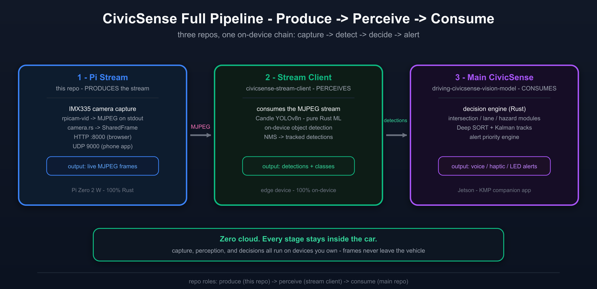
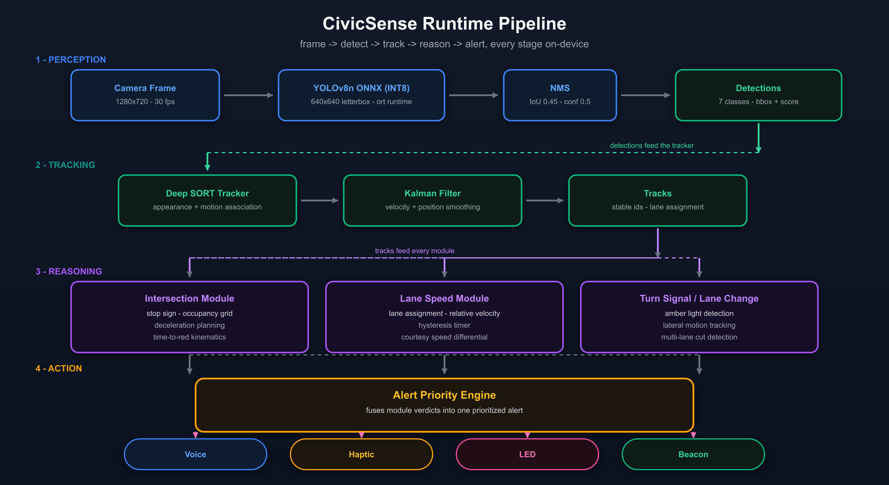
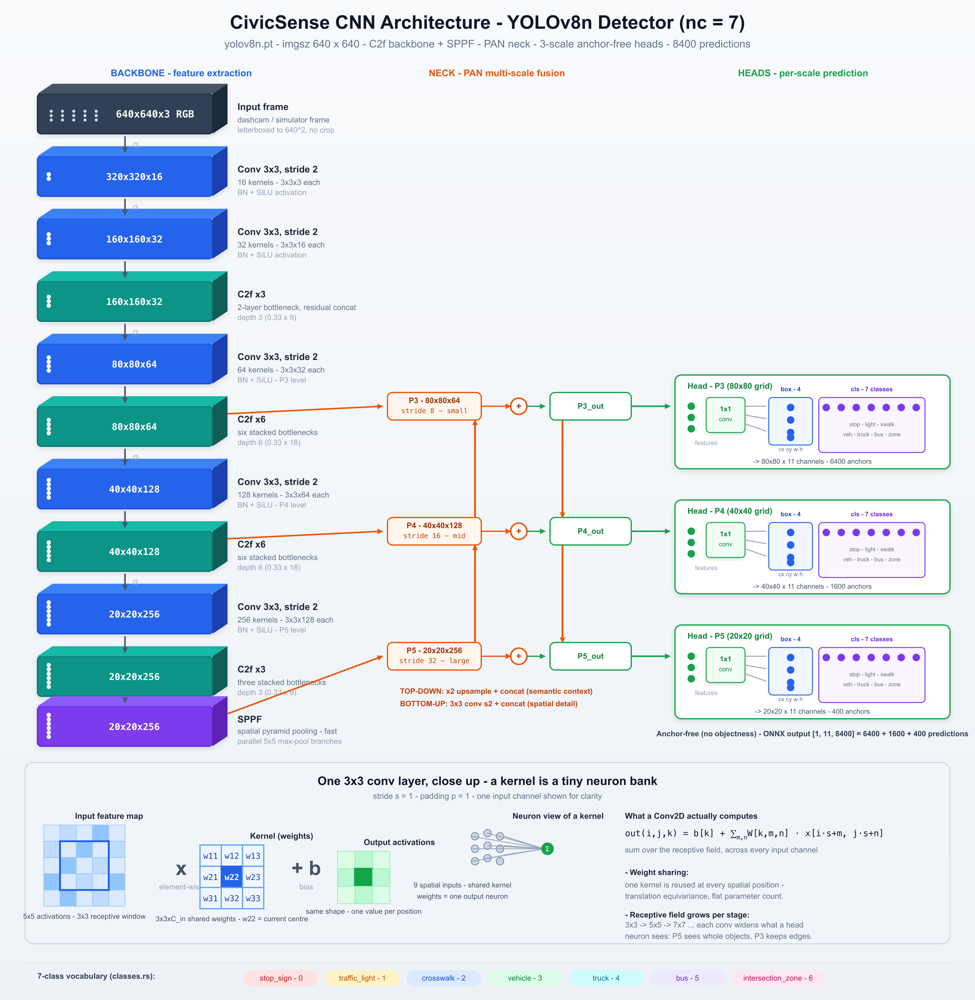
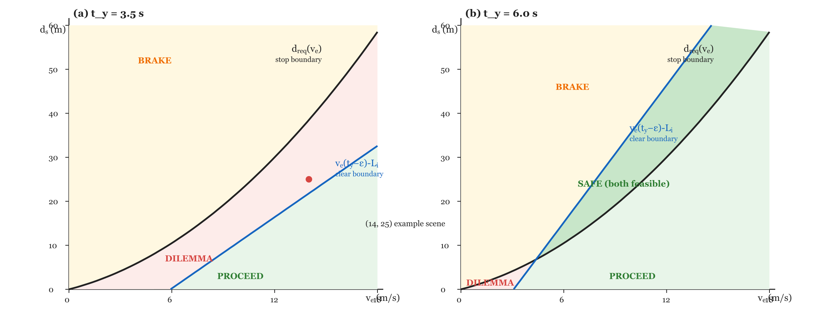
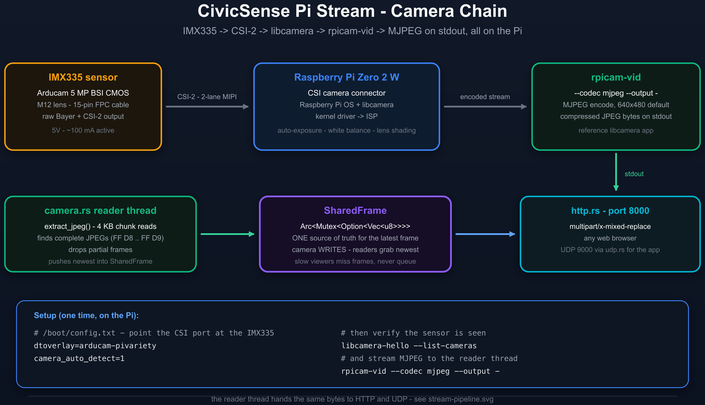
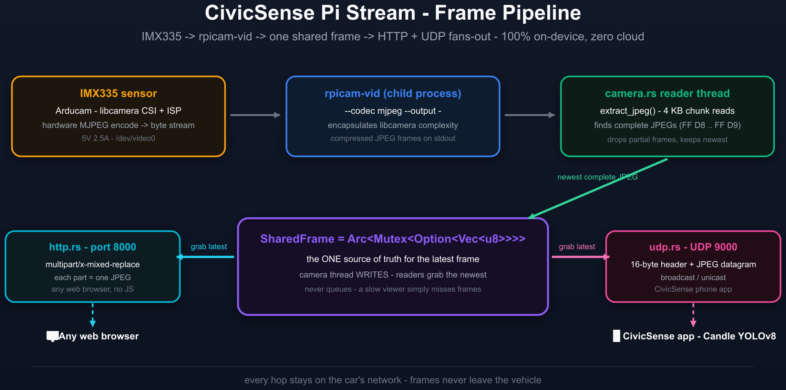
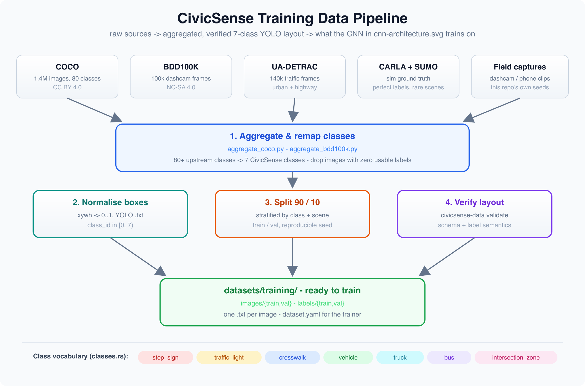
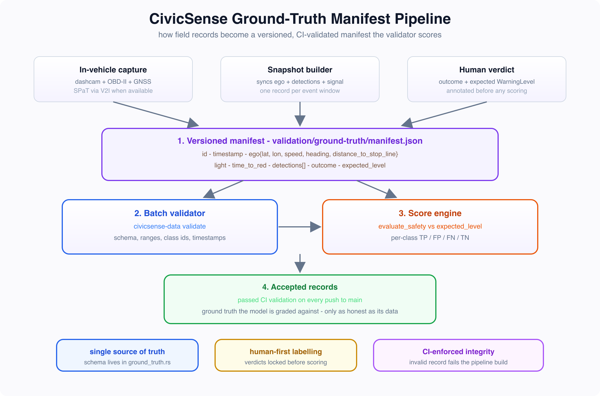
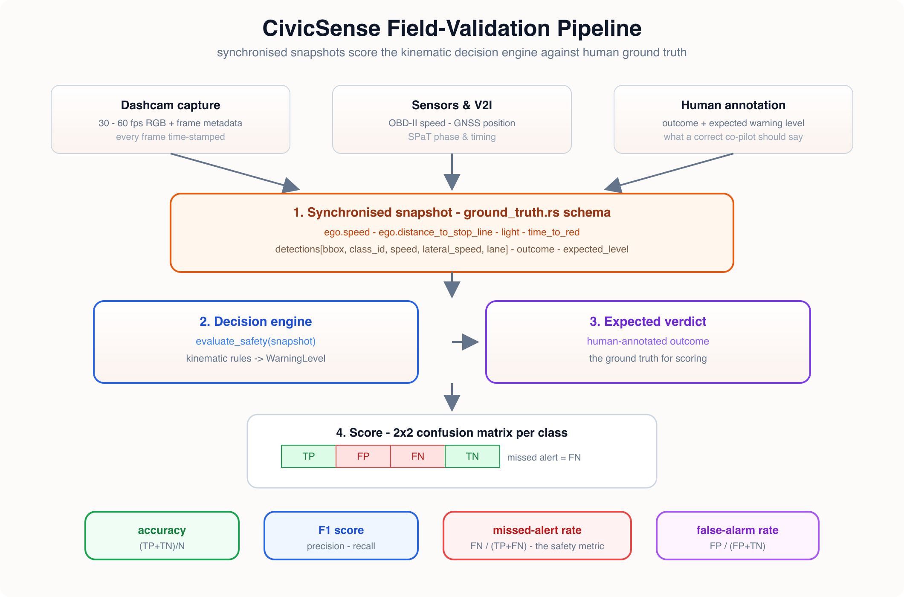
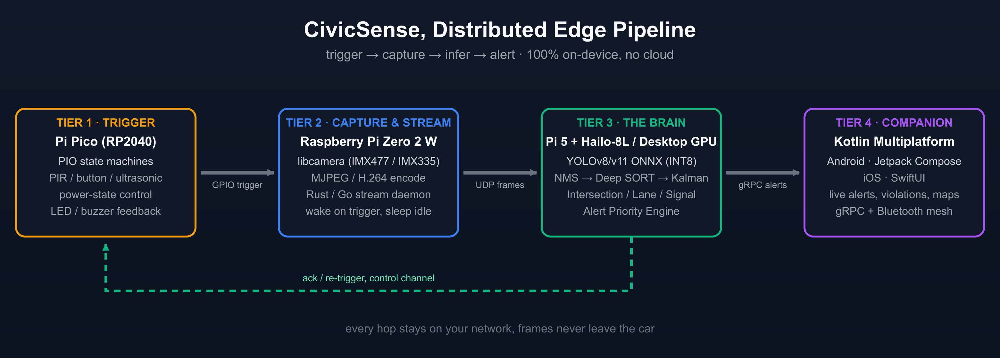

# System Design — Driving CivicSense Vision Model

[](../LICENSE)
[](https://arpanpathak.github.io/driving-civicsense-vision-model/)
[](https://www.nvidia.com/en-us/autonomous-machines/embedded-systems/jetson-orin/)
[](#8-required-hardware--accessories)
[](#9-credits--amazon-mlu)

A **camera-only, edge-native AI system** that detects vehicles, tracks them across
lanes, reasons about the *dilemma zone* and blocked-box scenarios with a deterministic
kinematic decision engine, and issues prioritized warnings — **entirely on-device, with
zero cloud dependency**. No video ever leaves the vehicle.

- **PDF of this document:** [System-Design.pdf](System-Design.pdf)
- **Diagram sources:** [`diagrams/`](diagrams/) (SVG + rendered PNG for every figure)

---

## Executive summary

| Property | Design choice |
|---|---|
| **Input** | Single forward-facing CSI camera (Jetson CSI or Pi Zero 2 W), 30 fps |
| **Perception** | YOLOv8n ONNX, INT8 quantised, 7 classes, ~8,400 predictions/frame |
| **Tracking** | Deep SORT + Kalman filter (position/velocity smoothing, lane assignment) |
| **Decision** | Deterministic, severity-ordered kinematic rule pipeline in Rust, **O(n)**/frame, zero external deps |
| **Output** | Voice / haptic / LED / beacon alerts through a Kotlin Multiplatform companion app |
| **Guarantee** | Same input → same warning, always; proofs in the companion paper |
| **Privacy** | Zero cloud: capture, perception, decision all run on local hardware |

Two deployment topologies are supported: a **single-board** Jetson Orin Nano Super
(recommended) and a **distributed** Pi Zero 2 W → Pi 5 + Hailo-8L fallback for builders
who want to use commodity parts.

---

## 1. Architecture overview

The system is a closed loop of three stages — **produce → perceive → consume** — running
entirely inside the vehicle. A camera produces a video stream, the on-device perception
layer turns it into tracked detections, and the decision layer consumes those tracks to
issue alerts.



*Figure 1 — End-to-end system: capture, perception, and decision all stay in the vehicle.*

| Stage | Component | Responsibility |
|---|---|---|
| **Produce** | `civicsense-pi-stream` (Pi Zero 2 W, 100% Rust) | Capture via CSI camera, MJPEG encode, stream over HTTP/UDP |
| **Perceive** | `civicsense-stream-client` (Candle YOLOv8n) | On-device detection, NMS, tracking → tracked detections |
| **Consume** | Main `driving-civicsense-vision-model` (Rust) | Kinematic decision engine, alert priority, HMI |

---

## 2. Runtime pipeline (on-device)

The runtime is a fixed, four-stage dataflow: **frame → detect → track → reason → alert**.
Every stage runs on device; nothing is deferred to a server.



*Figure 2 — The on-device runtime pipeline.*

1. **Perception** — A 1280×720 camera frame is letterboxed to 640×640 and passed through
   YOLOv8n (ONNX Runtime, INT8 quantised, 7 classes). NMS (IoU 0.45, conf 0.5) collapses
   overlapping boxes into clean detections.
2. **Tracking** — Deep SORT associates detections across frames by appearance + motion;
   a Kalman filter smooths position and velocity, producing stable track IDs with lane
   assignment. The filter also estimates **lateral speed**, which the cut-in rule consumes.
3. **Reasoning** — three parallel modules — **Intersection**, **Lane speed**, and
   **Turn-signal / lane change** — each emit constraint violations. The modules are pure
   functions over the tracked state; the kinematics are closed-form and proven.
4. **Action** — the **Alert Priority Engine** fuses module verdicts into exactly one
   severity-ordered warning and drives the output channels.

---

## 3. Perception: the YOLOv8n CNN

Detection is a small, efficient YOLOv8n architecture tuned to the seven classes that
matter for intersection discipline: stop sign, traffic light, crosswalk, vehicle, truck,
bus, and intersection zone.



*Figure 3 — YOLOv8n detector: C2f backbone + SPPF → PAN neck → 3 anchor-free heads.*

- **Backbone** — CSP (C2f) blocks with an SPPF layer downsample the 640×640×3 input to
  three multi-scale feature maps (P3/P4/P5, strides 8/16/32).
- **Neck** — the PAN (Path Aggregation Network) fuses semantic context (top-down) with
  spatial detail (bottom-up) across scales.
- **Heads** — three anchor-free heads, one per scale, output box coordinates plus class
  probabilities: **8,400 predictions per frame**.
- **Deployment** — INT8-quantised ONNX, executed by the pure-Rust **Candle** runtime on
  the streaming client, or ONNX Runtime on the Jetson. No Python in the loop.

---

## 4. Decision engine: deterministic kinematic rules

The decision engine is the heart of the system and the reason it is auditable: **no
neural network decides anything**. Every criterion is a closed-form kinematic theorem
proved in the companion paper, and the pipeline fires the most severe applicable rule.

The rules run in fixed severity order, so the first match wins:

```
rule_light → rule_dilemma → rule_lead → rule_cutin → rule_stale
(red/yellow) (stop vs clear)  (leader)   (lane change)   (advisory)
```

| Rule | Trigger (kinematic criterion) | Level |
|---|---|---|
| **Red / yellow** | Signal phase with time-to-red below threshold | Critical / Caution |
| **Dilemma zone** | Neither a safe stop (`d ≤ v²/2a`) nor a safe clear (`v·t > d + L`) exists | Critical |
| **Lead blocked** | Leader stopped inside the intersection box, or too slow to clear | Critical / Warning |
| **Cut-in** | Adjacent vehicle *signaling* with a stable track (≥3 frames), plausible lateral speed (≤4 m/s), whose predicted intrusion lands inside the ego stopping distance before red | Warning |
| **Stale green** | Green with clearance infeasible before the (conservative) time-to-red | Caution |

The engine is a **pure function over a bounded input space**: identical inputs always
produce identical outputs, it is **O(n)** per frame with n ≤ 12 detections, and its
behaviour is exhaustively evaluated over 15,840 discretised states plus a 10,000-scene
Monte Carlo campaign against an independent theorem oracle.



*Figure 4 — The dilemma zone: the region where neither stopping nor clearing is safe.*

> The mathematical development — five theorems with complete, hand-checked proofs — is
> in the [companion paper](https://arpanpathak.github.io/driving-civicsense-vision-model/).

---

## 5. Camera & streaming pipeline

The camera layer ships in two flavours depending on the topology: **direct CSI capture**
on the Jetson (zero-latency, one board) or an **MJPEG streaming server** on a Pi Zero 2 W
(distributed fallback). Both are 100% Rust.



*Figure 5 — Camera pipeline: capture, encode, and stream.*



*Figure 6 — The Pi Zero streaming server: MJPEG over HTTP / UDP / stdout, ~50 MB RAM, ~15 FPS at 640×480.*

---

## 6. Data & model pipeline

The model behind the perception layer is trained, validated, and ground-truthed by a
separate data-pack pipeline (`driving-civic-sense-data-crowd`). This is where the
training data, label format, and field ground truth are defined and verified.



*Figure 7 — Model training pipeline: data curation → YOLO training → export.*



*Figure 8 — Field ground-truth pipeline: synchronized logs are turned into verified labels.*



*Figure 9 — Validation pipeline: a hard validator rejects malformed labels so no bad example ever enters training.*

The data pipeline enforces a strict rule: **no malformed label enters the training
pipeline**. Every field log is validated before it contributes to a dataset.

---

## 7. Deployment topology

Two supported paths, from the project README:

- **Recommended — single board:** plug a CSI camera into a **Jetson Orin Nano Super**
  (67 INT8 TOPS, 8 GB unified memory, 7–15 W). The full stack — YOLO, Deep SORT,
  kinematic engine, alert dispatch — runs on one board, no network hops.
- **Budget / DIY — distributed:** a **Pi Zero 2 W** with an Arducam IMX335 captures and
  streams; a **Pi 5 + Hailo-8L** (or a desktop GPU) runs inference; the KMP companion
  app alerts the driver.



*Figure 10 — The distributed topology: each node does the job it is best at.*

---

## 8. Required hardware & accessories

All links are plain **Amazon search links** (no affiliation) — pick the listing, bundle,
and storefront for your region.

| Component | Role | Amazon |
|---|---|---|
| **NVIDIA Jetson Orin Nano Super Developer Kit** (67 INT8 TOPS, 8 GB, 7–15 W) | Primary brain: full on-device pipeline | [search on Amazon](https://www.amazon.com/s?k=nvidia+jetson+orin+nano+super+developer+kit) |
| **CSI camera module** (IMX219 / IMX477 / IMX462) | Camera input for the Jetson | [search on Amazon](https://www.amazon.com/s?k=csi+camera+module+jetson+orin+nano) |
| **Raspberry Pi Zero 2 W** | Budget streaming node (distributed fallback) | [search on Amazon](https://www.amazon.com/s?k=raspberry+pi+zero+2+w) |
| **Arducam IMX335 camera** (or any IMX335 CSI module) | Dashcam puck sensor for the Pi Zero 2 W | [search on Amazon](https://www.amazon.com/s?k=arducam+imx335+raspberry+pi+camera) |
| **Raspberry Pi 5** (4/8 GB) | Budget brain (distributed fallback) | [search on Amazon](https://www.amazon.com/s?k=raspberry+pi+5) |
| **Hailo-8L M.2 AI accelerator** | Budget NPU for the Pi 5 brain | [search on Amazon](https://www.amazon.com/s?k=hailo-8l+m.2+ai+accelerator) |
| **High-endurance microSD card** (32 GB+, A2) | Boot and log storage for every board | [search on Amazon](https://www.amazon.com/s?k=high+endurance+microsd+card+a2+32gb) |
| **USB-C power supply** (27 W+ / Jetson-rated) | Power for the brain boards | [search on Amazon](https://www.amazon.com/s?k=usb-c+power+supply+27w+raspberry+pi+5) |
| **Dashcam case / 3D-printed puck housing** *(optional)* | Mounting and thermal management | [search on Amazon](https://www.amazon.com/s?k=raspberry+pi+dashcam+case) |

---

## 9. Credits — Amazon MLU

I learned computer vision at **Amazon** from the Applied Scientists of
**Amazon Machine Learning University (MLU)**, and this project stands on that foundation.
The CNN and object-detection fundamentals behind the YOLO-based perception layer — plus
the habit of reasoning about models as engineering artifacts — came straight from MLU's
free, world-class curriculum. Deep gratitude to the MLU team for opening this education
to everyone.

- **MLU homepage:** https://aws.amazon.com/machine-learning/mlu/
- **MLU Accelerated Computer Vision (course repo):** https://github.com/aws-samples/aws-machine-learning-university-accelerated-cv
- **MLU-Explain (visual guides):** https://mlu-explain.github.io/

[](https://aws.amazon.com/machine-learning/mlu/)
[](https://github.com/aws-samples/aws-machine-learning-university-accelerated-cv)

---

## Appendix A — Diagram index

Every figure in this document, with its source repository and editable SVG.

| Figure | File | Source |
|---|---|---|
| 1 · End-to-end pipeline | `diagrams/full-pipeline.svg` | `civicsense-pi-stream` |
| 2 · Runtime pipeline | `diagrams/pipeline-flow.svg` | main repo `assets/` |
| 3 · YOLOv8n CNN | `diagrams/cnn-architecture.svg` | `driving-civic-sense-data-crowd` |
| 4 · Dilemma zone | `diagrams/fig-dilemma.svg` | main repo `docs/assets/` |
| 5 · Camera pipeline | `diagrams/camera-pipeline.svg` | `civicsense-pi-stream` |
| 6 · Streaming server | `diagrams/stream-pipeline.svg` | `civicsense-pi-stream` |
| 7 · Training pipeline | `diagrams/training-pipeline.svg` | `driving-civic-sense-data-crowd` |
| 8 · Ground-truth pipeline | `diagrams/ground-truth-pipeline.svg` | `driving-civic-sense-data-crowd` |
| 9 · Validation pipeline | `diagrams/validation-pipeline.svg` | `driving-civic-sense-data-crowd` |
| 10 · Distributed topology | `diagrams/pipeline.svg` | main repo `assets/` |

Additional reference figures from the paper (scene geometry, trajectories, velocity–time,
event timeline, architecture) are available in [`diagrams/`](diagrams/).

---

## License

This design documentation and the diagrams are part of the
[Driving CivicSense vision model](https://github.com/arpanpathak/driving-civicsense-vision-model)
repository and inherit its AGPL-3.0 license.
