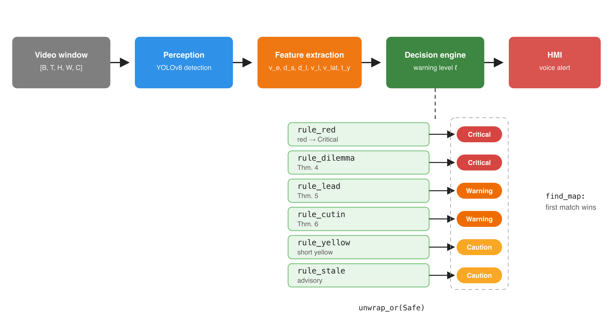
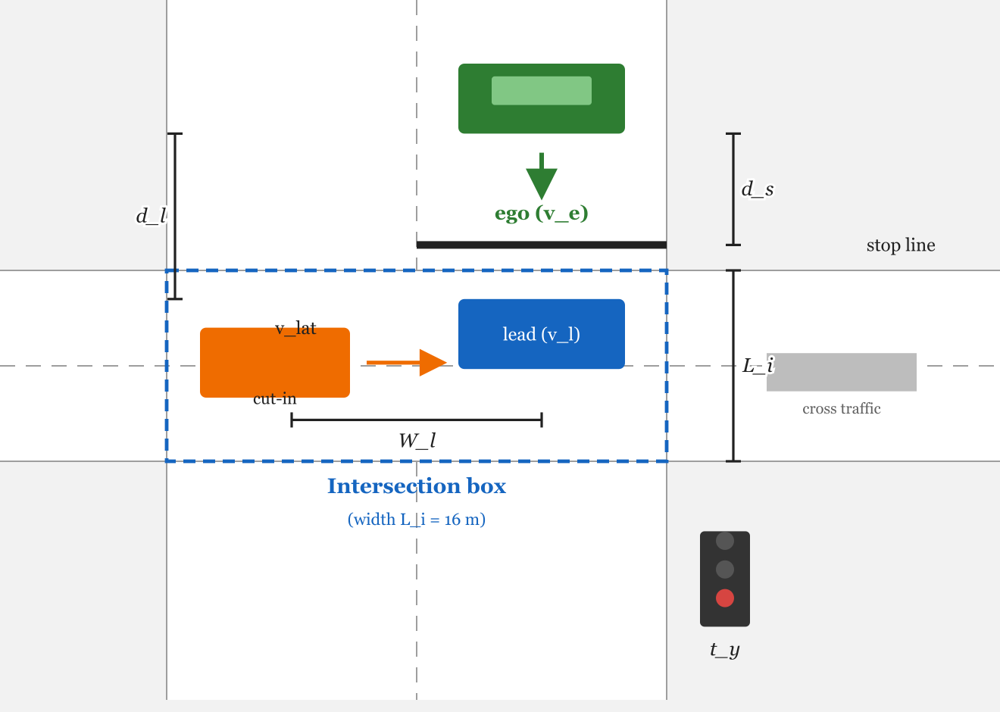
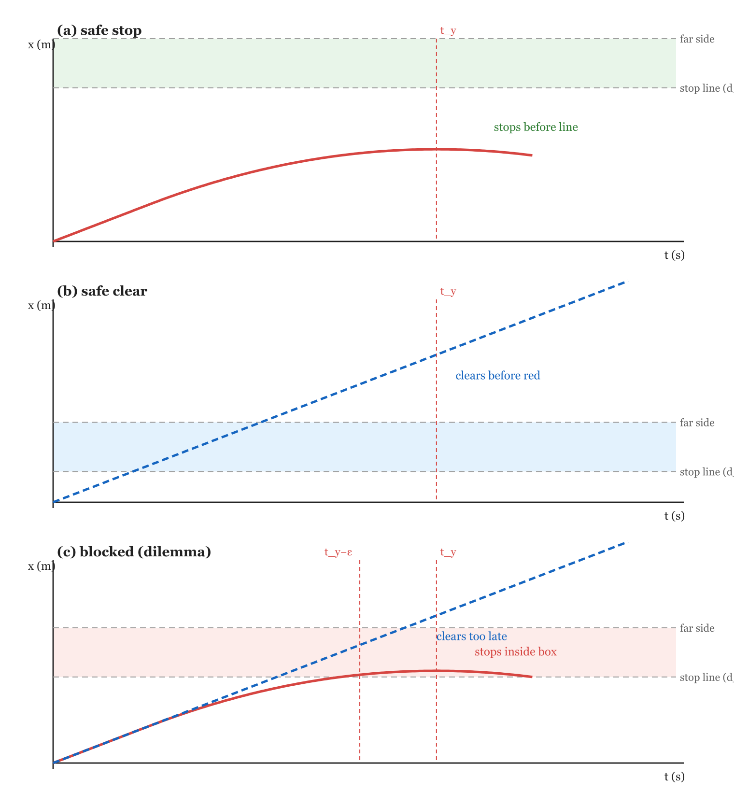
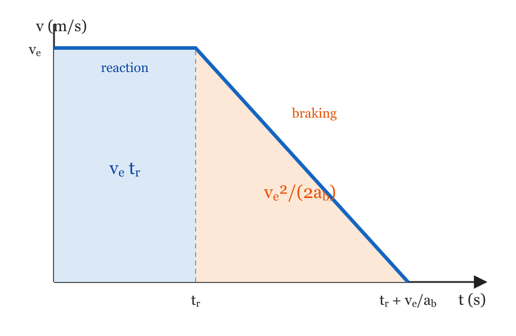
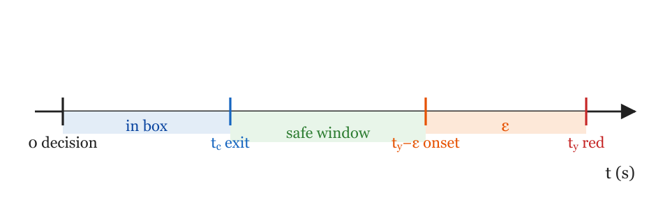

# System Design — Driving CivicSense Vision Model

[](../LICENSE)
[](https://arpanpathak.github.io/driving-civicsense-vision-model/)
[](https://www.nvidia.com/en-us/autonomous-machines/embedded-systems/jetson-orin/)
[](#required-hardware--accessories)
[](#special-thanks--amazon-mlu)

CivicSense is a **camera-only, edge-native AI system** for intersection discipline and
road civility: it detects vehicles, tracks them, reasons about the *dilemma zone* and
blocked-box scenarios with a **deterministic kinematic decision engine**, and issues
prioritized warnings — **entirely on-device, with zero cloud dependency**. No video ever
leaves the vehicle.

This folder collects the **system design diagrams** (rendered as PNGs, with the original
SVG sources alongside), the **required hardware and accessories**, and the credits for
the computer-vision foundation this project builds on.

---

## Special thanks — Amazon MLU

I learned computer vision at **Amazon** from the Applied Scientists of
**Amazon Machine Learning University (MLU)**, and this project stands on that
foundation. The CNN and object-detection fundamentals behind the YOLO-based
perception layer here — plus the habit of reasoning about models as engineering
artifacts — came straight from MLU's free, world-class curriculum. Deep gratitude
to the MLU team for making this education open to everyone.

- **MLU homepage:** https://aws.amazon.com/machine-learning/mlu/
- **MLU Accelerated Computer Vision (course repo):** https://github.com/aws-samples/aws-machine-learning-university-accelerated-cv
- **MLU-Explain (visual guides):** https://mlu-explain.github.io/

[](https://aws.amazon.com/machine-learning/mlu/)
[](https://github.com/aws-samples/aws-machine-learning-university-accelerated-cv)

---

## System overview

```
[ CSI Camera ] ──▶ [ Perception ] ──▶ [ Tracking ] ──▶ [ Reasoning ] ──▶ [ Alert ]
                 YOLOv8n ONNX    Deep SORT +       intersection /        voice,
                 (INT8, Candle   Kalman filter     lane / cut-in         haptic,
                 or ONNX RT)                       kinematic rules       LED / beacon
```

1. **Capture** — a CSI camera (directly on the Jetson, or on a Pi Zero 2 W for the
   distributed fallback) produces MJPEG video.
2. **Perceive** — YOLOv8n runs on-device (Candle pure-Rust runtime, or ONNX Runtime
   INT8), followed by NMS.
3. **Track** — Deep SORT + Kalman filtering turns detections into stable tracks with
   lane assignment.
4. **Reason** — the deterministic, severity-ordered Rust decision engine evaluates the
   kinematic theorems (stopping feasibility, clearance, dilemma zone, lead-vehicle and
   cut-in constraints) and emits exactly one warning level per frame in `O(n)`.
5. **Alert** — voice / haptic / LED / beacon, through the KMP companion app.

## Diagrams

All diagrams are rendered at 2x from their SVG sources, which are committed alongside
the PNGs for easy editing (`system_design/diagrams/*.svg`).

| Diagram | Source | Preview |
|---|---|---|
| **End-to-end pipeline** (Produce → Perceive → Consume, zero cloud) | `civicsense-pi-stream` → `pi_stream/assets/full-pipeline.svg` |  |
| **Runtime pipeline** (frame → detect → track → reason → alert) | main repo → `assets/pipeline-flow.svg` |  |
| **Distributed edge pipeline** (Pico → Pi Zero → brain) | main repo → `assets/pipeline.svg` |  |
| **Streaming server** (Pi Zero MJPEG) | `civicsense-pi-stream` → `pi_stream/assets/stream-pipeline.svg` |  |
| **Camera pipeline** (capture → encode → stream) | `civicsense-pi-stream` → `pi_stream/assets/camera-pipeline.svg` |  |
| **Paper — architecture** | main repo → `docs/assets/fig-architecture.svg` |  |
| **Paper — scene geometry** | main repo → `docs/assets/fig-scenario.svg` |  |
| **Paper — trajectories** | main repo → `docs/assets/fig-trajectories.svg` |  |
| **Paper — dilemma zone** | main repo → `docs/assets/fig-dilemma.svg` |  |
| **Paper — velocity–time** | main repo → `docs/assets/fig-vt.svg` |  |
| **Paper — event timeline** | main repo → `docs/assets/fig-timeline.svg` |  |

> **Submodule scan note:** the three pipeline diagrams above come from the
> [`civicsense-pi-stream`](https://github.com/arpanpathak/civicsense-pi-stream)
> submodule (`pi_stream/`). The other submodules
> ([`civicsense-stream-client`](https://github.com/arpanpathak/civicsense-stream-client),
> [`civicsense-companion`](https://github.com/arpanpathak/civicsense-companion),
> [`driving-civic-sense-data-crowd`](https://github.com/arpanpathak/driving-civic-sense-data-crowd.git))
> contain no SVG diagrams as of this snapshot.

---

## Required hardware & accessories

Two deployment paths, from the project README:

- **Recommended — single board:** NVIDIA Jetson Orin Nano Super + CSI camera. Everything
  runs on one board: capture, YOLO, Deep SORT, kinematic decision engine, alert dispatch.
- **Budget / DIY fallback — distributed:** Pi Zero 2 W streams (with an Arducam IMX335
  camera), a Pi 5 + Hailo-8L (or desktop GPU) runs the inference.

The links below are plain **Amazon search links** (no affiliation) — pick the listing,
bundle, and Amazon storefront that suits your region.

| Component | Role | Amazon |
|---|---|---|
| **NVIDIA Jetson Orin Nano Super Developer Kit** (67 INT8 TOPS, 8 GB, 7–15 W) | Primary brain: full on-device pipeline | [search on Amazon](https://www.amazon.com/s?k=nvidia+jetson+orin+nano+super+developer+kit) |
| **CSI camera module** (IMX219 / IMX477 / IMX462) | Camera input for the Jetson | [search on Amazon](https://www.amazon.com/s?k=csi+camera+module+jetson+orin+nano) |
| **Raspberry Pi Zero 2 W** | Budget streaming node (distributed fallback) | [search on Amazon](https://www.amazon.com/s?k=raspberry+pi+zero+2+w) |
| **Arducam IMX335 camera** (or any IMX335 CSI module) | Dashcam puck sensor for the Pi Zero 2 W | [search on Amazon](https://www.amazon.com/s?k=arducam+imx335+raspberry+pi+camera) |
| **Raspberry Pi 5** (4/8 GB) | Budget brain (distributed fallback) | [search on Amazon](https://www.amazon.com/s?k=raspberry+pi+5) |
| **Hailo-8L M.2 AI accelerator** | Budget NPU for the Pi 5 brain | [search on Amazon](https://www.amazon.com/s?k=hailo-8l+m.2+ai+accelerator) |
| **High-endurance microSD card** (32 GB+, A2) | Boot and log storage for every board | [search on Amazon](https://www.amazon.com/s?k=high+endurance+microsd+card+a2+32gb) |
| **USB-C power supply** (27 W+ for Pi 5 / Jetson-rated) | Power for the brain boards | [search on Amazon](https://www.amazon.com/s?k=usb-c+power+supply+27w+raspberry+pi+5) |
| **Dashcam case / 3D-printed puck housing** *(optional)* | Mounting and thermal management | [search on Amazon](https://www.amazon.com/s?k=raspberry+pi+dashcam+case) |

> Amazon is the reference marketplace for the off-the-shelf accessories above — the
> boards and NPUs are commodity hardware available at most major electronics retailers.

---

## License

This design documentation and the diagrams are part of the
[Driving CivicSense vision model](https://github.com/arpanpathak/driving-civicsense-vision-model)
repository and inherit its AGPL-3.0 license.
